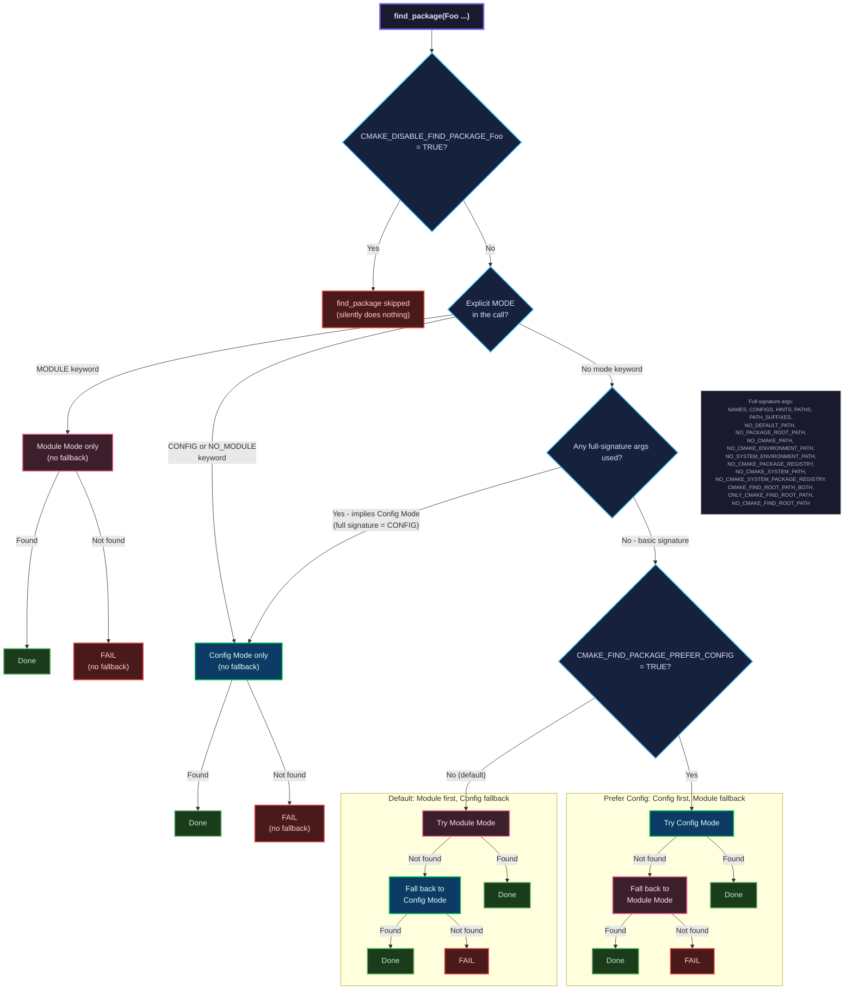
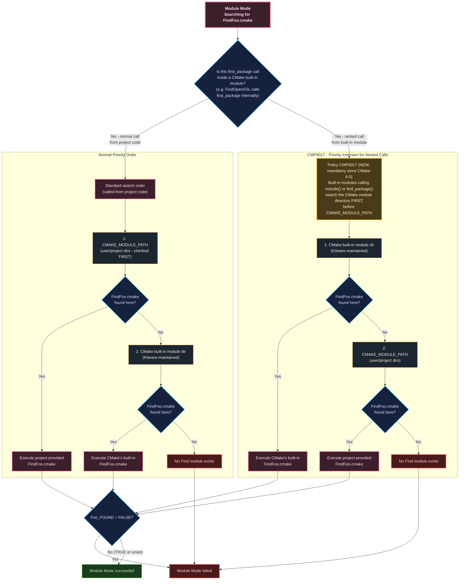

# Troubleshooting CMake find_package()

This page provides flowcharts for each stage of `find_package()`, followed by troubleshooting tips.
This page does not attempt to document `find_package()`, for that, see the official documentation
and guides:

* <https://cmake.org/cmake/help/latest/command/find_package.html>
* <https://cmake.org/cmake/help/book/mastering-cmake/chapter/Finding%20Packages.html>
* <https://cmake.org/cmake/help/latest/guide/using-dependencies/index.html>

## Modes?

**Module mode** searches for a `FindFoo.cmake` file (a "find module") that contains the logic to
locate a package. Find modules are either provided by CMake itself (e.g. `FindOpenSSL.cmake`) or by
your project via `CMAKE_MODULE_PATH`. Module mode is only available with the basic signature.

**Config mode** searches for a `FooConfig.cmake` or `foo-config.cmake` file (a "config file") that
the package itself installs. Config mode supports the full range of `find_package()` arguments and
is the preferred mechanism for modern CMake packages.

When you call `find_package(Foo)` with the basic signature (no `CONFIG`, `MODULE`, or full-signature
arguments), CMake tries Module mode first and falls back to Config mode. This default can be
reversed with `CMAKE_FIND_PACKAGE_PREFER_CONFIG`.

## Mode selection and dispatch

This flowchart shows how `find_package()` decides which mode(s) to try.



```{info}
If `REQUIRED` was specified, FAIL is a fatal error. Otherwise `Foo_FOUND` is set to FALSE and
configuration continues.
```

## Module mode

Module mode searches for a `FindFoo.cmake` file and executes it. The find module is responsible for
locating the package's headers, libraries, etc. and setting `Foo_FOUND`.



```{warning}
Find modules communicate success or failure by setting `Foo_FOUND`. Most use
[`find_package_handle_standard_args()`](https://cmake.org/cmake/help/latest/module/FindPackageHandleStandardArgs.html)
to do this, which checks that required variables like `Foo_INCLUDE_DIR` and `Foo_LIBRARY` were
populated, and handles `REQUIRED` and `QUIET`. Find modules don't *need* to handle `REQUIRED`
themselves - `find_package()` reads `Foo_FOUND` after the module returns and emits the fatal error
itself if the package wasn't found and `REQUIRED` was specified.

If a find module does not set `Foo_FOUND` at all, `find_package()` assumes the package was found. It
only treats the package as *not* found if `Foo_FOUND` was explicitly set to `FALSE`. **This is
surprising behavior**, so I recommend setting `Foo_FOUND` explicitly in your find modules rather
than implicitly assuming success.

See: <https://gitlab.kitware.com/cmake/cmake/-/blob/367abd8da0304532d888bd86f5cba0721cfce68d/Source/cmFindPackageCommand.cxx#L1590>
```

## Config mode

Config mode searches for a `FooConfig.cmake` or `foo-config.cmake` file that the package itself
installed. It searches a well-defined sequence of prefixes, trying a set of subdirectory patterns
under each one.

```mermaid
flowchart TD
    classDef entrypoint fill:#0d3b66,color:#e0fff0,stroke:#00c853,stroke-width:3px,font-weight:bold
    classDef decision fill:#16213e,color:#e0e0ff,stroke:#4fc3f7,stroke-width:2px
    classDef pathnode fill:#1b2631,color:#ffeedd,stroke:#ffb74d,stroke-width:1px
    classDef action fill:#0d3b66,color:#e0fff0,stroke:#00c853,stroke-width:2px
    classDef result fill:#1a3c1a,color:#c8e6c9,stroke:#66bb6a,stroke-width:2px
    classDef failure fill:#4a1a1a,color:#ffcdd2,stroke:#ef5350,stroke-width:2px
    ENTRY["Config Mode<br>Searching for FooConfig.cmake<br>or foo-config.cmake"]:::entrypoint

    ENTRY --> CACHE

    CACHE{"Foo_DIR already in cache<br>from a previous run?"}:::decision
    CACHE -->|Yes| CACHE_HIT["Use cached Foo_DIR<br>(skip search, re-load config)"]:::result
    CACHE -->|No| SEARCH_ORDER

    subgraph SEARCH_ORDER ["Search prefixes in order"]
        direction TB
        PR["0. CMAKE_FIND_PACKAGE_REDIRECTS_DIR<br>(FetchContent redirect configs)"]:::pathnode
        PR --> P0
        P0["1. Foo_ROOT variable and env var<br>(CMake 3.12+, also FOO_ROOT via CMP0144)<br>Skipped by: NO_PACKAGE_ROOT_PATH"]:::pathnode
        P0 --> P1["2. CMAKE_PREFIX_PATH (variable)<br>CMAKE_FRAMEWORK_PATH, CMAKE_APPBUNDLE_PATH<br>Skipped by: NO_CMAKE_PATH"]:::pathnode
        P1 --> P2["3. Foo_DIR, CMAKE_PREFIX_PATH (env vars)<br>CMAKE_FRAMEWORK_PATH, CMAKE_APPBUNDLE_PATH (env)<br>Skipped by: NO_CMAKE_ENVIRONMENT_PATH"]:::pathnode
        P2 --> P2H["4. HINTS (from the find_package call)"]:::pathnode
        P2H --> P3["5. PATH env variable<br>(parent dirs of /bin and /sbin entries)<br>Skipped by: NO_SYSTEM_ENVIRONMENT_PATH"]:::pathnode
        P3 --> P3R["6. User Package Registry<br>(~/.cmake/packages/ on Linux)<br>Skipped by: NO_CMAKE_PACKAGE_REGISTRY"]:::pathnode
        P3R --> P4["7. CMAKE_SYSTEM_PREFIX_PATH<br>CMAKE_SYSTEM_FRAMEWORK_PATH<br>CMAKE_SYSTEM_APPBUNDLE_PATH<br>(includes CMAKE_INSTALL_PREFIX, platform defaults)<br>Skipped by: NO_CMAKE_SYSTEM_PATH"]:::pathnode
        P4 --> P4R["8. System Package Registry<br>Skipped by: NO_CMAKE_SYSTEM_PACKAGE_REGISTRY"]:::pathnode
        P4R --> P5["9. PATHS (from the find_package call)<br>(hard-coded guesses)"]:::pathnode
    end

    P5 --> SUFFIX_SEARCH

    subgraph SUFFIX_SEARCH ["At each prefix, try these subdirectory patterns"]
        direction TB
        SUFFIXES["For each prefix, search subdirs:<br><br>Windows-only (W):<br>- prefix/<br>- prefix/(cmake|CMake)/<br>- prefix/Foo*/<br>- prefix/Foo*/(cmake|CMake)/<br><br>Unix-only (U):<br>- prefix/(lib/&lt;arch&gt;|lib*|share)/cmake/Foo*/<br>- prefix/(lib/&lt;arch&gt;|lib*|share)/Foo*/<br>- prefix/(lib/&lt;arch&gt;|lib*|share)/Foo*/(cmake|CMake)/<br><br>Both (W/U):<br>- prefix/Foo*/(lib/&lt;arch&gt;|lib*|share)/cmake/Foo*/<br>- prefix/Foo*/(lib/&lt;arch&gt;|lib*|share)/Foo*/<br>- prefix/Foo*/(lib/&lt;arch&gt;|lib*|share)/Foo*/(cmake|CMake)/"]:::action
        SUFFIXES --> FILENAMES["In each subdir, look for:<br>- FooConfig.cmake (case-preserved)<br>- foo-config.cmake (lowercase)"]:::action
    end

    FILENAMES --> FOUND{"Config file found?"}:::decision
    FOUND -->|No| NOTFOUND["Config Mode failed"]:::failure
    FOUND -->|Yes| VERSION_CHECK

    VERSION_CHECK{"Version file exists?<br>(FooConfigVersion.cmake or<br>Foo-config-version.cmake)"}:::decision
    VERSION_CHECK -->|"No version file"| ASSUME_OK["Assumed compatible<br>(no version check possible)"]:::action
    VERSION_CHECK -->|"Version file found"| VER_MATCH{"Requested version<br>compatible?"}:::decision

    VER_MATCH -->|Yes| LOAD_CONFIG
    VER_MATCH -->|"No - mismatch"| CONTINUE["Skip this candidate,<br>continue searching<br>remaining paths"]:::action
    CONTINUE --> FOUND

    ASSUME_OK --> LOAD_CONFIG
    LOAD_CONFIG["Load FooConfig.cmake<br>Sets targets, variables, etc."]:::action
    LOAD_CONFIG --> COMPONENTS

    COMPONENTS{"COMPONENTS requested<br>and config checks them?"}:::decision
    COMPONENTS -->|"All satisfied<br>(or none requested)"| DONE["Config Mode succeeded<br>Foo_DIR cached for future runs"]:::result
    COMPONENTS -->|"Component missing<br>(config sets Foo_FOUND=FALSE)"| COMP_FAIL["Config Mode failed<br>(component not found)"]:::failure
```



```{info}
**Config file naming:** CMake searches for two naming conventions: `FooConfig.cmake` (the original
CamelCase convention) and `foo-config.cmake` (added in CMake 2.6 to mirror the Unix
`pkg-config`/autotools naming style). Packages ship one or the other; CMake searches for both.
Packages normally pick one that matches their conventions.
```

```{info}
**FetchContent redirects:** `FetchContent_MakeAvailable()` generates config files in
`CMAKE_FIND_PACKAGE_REDIRECTS_DIR` (step 0 above) and sets `CMAKE_FIND_PACKAGE_PREFER_CONFIG` to
`TRUE` so that Config mode runs before Module mode. This ensures `find_package()` picks up the
FetchContent-provided package.
```

```{info}
**Root variable stacking:** If this Config mode search happens inside a find module (nested call),
the parent package's `_ROOT` paths are also searched, after the current package's `_ROOT` paths.
```

```{info}
**Global suppression variables** (CMake 3.16+) can disable individual search steps:
`CMAKE_FIND_USE_PACKAGE_ROOT_PATH`, `CMAKE_FIND_USE_CMAKE_PATH`,
`CMAKE_FIND_USE_CMAKE_ENVIRONMENT_PATH`, `CMAKE_FIND_USE_SYSTEM_ENVIRONMENT_PATH`,
`CMAKE_FIND_USE_CMAKE_SYSTEM_PATH`. `NO_DEFAULT_PATH` enables all `NO_*` flags at once.
```

## Troubleshooting

### Use --debug-find first

Before anything else, re-run your CMake configure with `--debug-find-pkg=Foo` (or `--debug-find` for
all packages):

```sh
cmake -S . -B build --debug-find-pkg=Foo
```

This prints the complete search log: which mode was selected, every directory searched, and why each
candidate was accepted or rejected. **It's the single most useful tool for diagnosing
`find_package()` failures.**

### Which mode is being used?

If you're not sure which mode CMake is using:

* **No mode keyword and no full-signature args** - Module mode first, Config mode fallback (the
  default).
* **`CONFIG`, `NO_MODULE`, or full-signature args** (e.g. `PATHS`, `NAMES`, `CONFIGS`, `HINTS`,
  `PATH_SUFFIXES`, `NO_*` flags) - Config mode only.
* **`MODULE`** - Module mode only.
* **`CMAKE_FIND_PACKAGE_PREFER_CONFIG=TRUE`** - Config mode first, Module mode fallback.

A common surprise: using _any_ full-signature argument silently forces Config mode with no Module
fallback.

### Package installed to a non-standard prefix

If the package is installed to e.g. `/opt/foo`, tell CMake where to look. The best options, in order
of preference:

1. **`CMAKE_PREFIX_PATH`** - the most common and general-purpose approach:
   ```sh
   cmake -S . -B build -DCMAKE_PREFIX_PATH=/opt/foo
   ```
   This works for both Config mode and the `find_library`/`find_path` calls inside Module mode.

2. **`Foo_ROOT`** (CMake 3.12+) - package-specific, searched first:
   ```sh
   cmake -S . -B build -DFoo_ROOT=/opt/foo
   ```

3. **`Foo_DIR`** - points directly to the directory containing `FooConfig.cmake`, not the install
   prefix:
   ```sh
   cmake -S . -B build -DFoo_DIR=/opt/foo/lib/cmake/Foo
   ```

`CMAKE_PREFIX_PATH` and `Foo_ROOT` point to the _install prefix_ (e.g. `/opt/foo`). `Foo_DIR` points
to the _cmake config directory_ (e.g. `/opt/foo/lib/cmake/Foo`). Confusing these is a common
`find_package()` mistake.

### Stale cache

If `find_package()` previously found a package at a location that no longer exists (or found the
wrong version), CMake may keep using the stale cached `Foo_DIR`. The `--debug-find` output will show
it using the cached path without searching. The fix is to reconfigure.

### Config file exists but isn't found

If you know a `FooConfig.cmake` exists but CMake can't find it, check:

1. **Is the config file in a searched subdirectory pattern?** Config mode looks for the file under
   specific subdirectories of each prefix (e.g. `lib/cmake/Foo/`, `share/Foo/`, `lib/Foo*/`). If the
   file is at `prefix/some/unusual/path/FooConfig.cmake`, CMake won't find it.

2. **Is the prefix in the search path?** The config file's install prefix must be reachable through
   one of the nine search steps in the Config mode flowchart.

3. **Check the filename.** CMake looks for `FooConfig.cmake` and `foo-config.cmake` Note that
   `FooConfig.cmake` uses the caller's capitalization from `find_package(Foo)`, so on case-sensitive
   filesystems, `find_package(foo)` searches for `fooConfig.cmake`, which won't match
   `FooConfig.cmake`. The lowercase-hyphen variant doesn't have this problem.

4. **Version mismatch.** If a version was requested but the `FooConfigVersion.cmake` file reports an
   incompatible version, that candidate is silently skipped. Use `--debug-find` to see version check
   results.

### Module mode: find module exists but fails

If a `FindFoo.cmake` exists but doesn't find the package, the problem is usually inside the find
module. Most find modules use `find_library()`, `find_path()`, and `find_program()`, which have
their own search paths.
