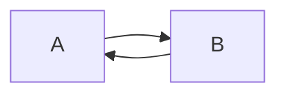

# Example draft - h1

```{toc}
```

## Intro - h2

* bulleted
* list
    * sublist

      with sub-paragraph

      ```python
      and a code block
      ```

```{info}
This is a info admonition.
```

## Image

In its own paragraph


Inline  with a sentence.

## quote block

> Here's a quoted paragraph.
>
> It also contains a code block
> ```python
> from __future__ import braces
> ```

## Mermaid.js


