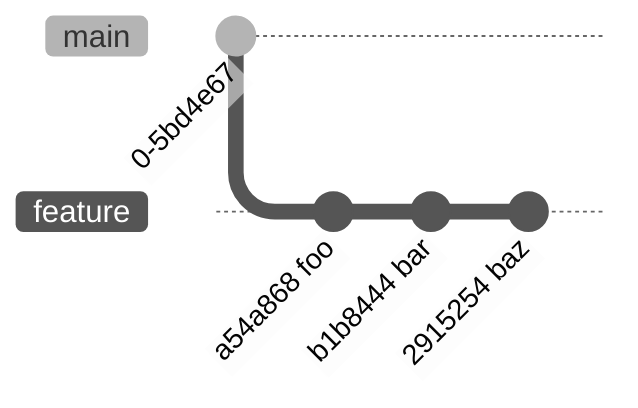
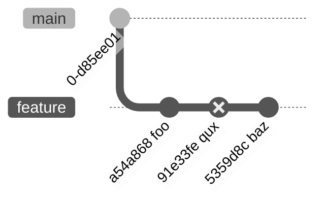
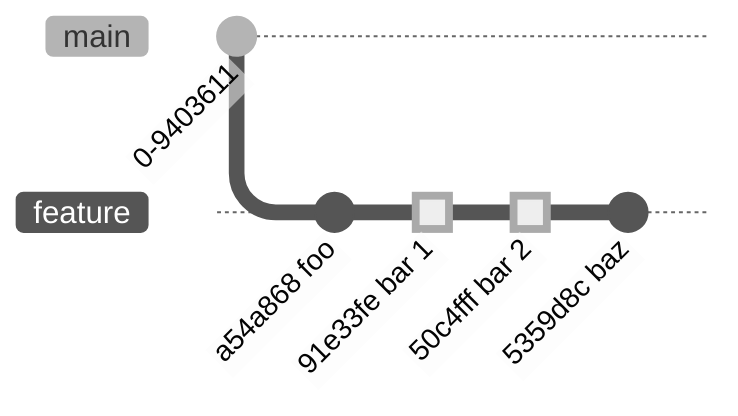
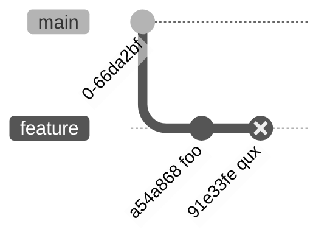

# Git: Techniques for rewriting history

There are many ways to use Git. While I have opinions on the "right" way to use Git, I wanted to
discuss the **how** and the **why** separately, because the why can quickly turn into a heated
debate.

Ultimately, those opinions result in the need to frequently rewrite history to get from a messy
state, to one that will provide future code archaeologists enough information to understand what the
$%^@ I was thinking when I introduced what's so clearly a bug that's discovered 6 years later.

```{toc}
```

## Environment

I use the following [git-config(1)](https://git-scm.com/docs/git-config#Documentation/git-config)
settings

```sh
git config --global core.editor vim
git config --global pull.rebase true
git config --global diff.submodule log
git config --global fetch.prune true
git config --global rerere.enabled true
git config --global commit.verbose true
```

there's more [here](https://github.com/Notgnoshi/dotfiles/blob/master/dotfiles/.gitconfig)
but these are the important ones.

This `git lg` alias
```sh
git config --global alias.lg "log --color --graph --pretty=format:'%C(auto)%h%d %s, %C(black)%C(bold)%an, %ar' --abbrev-commit --decorate"
```
will generate log output like

```sh
$ git lg
* 5a88c57 (HEAD -> main, origin/main) Test updating version file with new dockerified implementation, Notgnoshi, 3 months ago
* 414e796 Link back to release-tools, Notgnoshi, 3 months ago
* 91e33fe (tag: v0.3.1) Release 0.3.1, Notgnoshi, 3 months ago
* eb758b1 Use main reference for release-tools, Notgnoshi, 3 months ago
*   b4d6d41 (tag: v0.3.0) Merge branch 'ag/test-versioning' into 'main', Notgnoshi, 3 months ago
|\
| * 787e9d1 Release 0.3.0, Notgnoshi, 3 months ago
| * a54a868 Only make releases on merges to main or release branches, Notgnoshi, 3 months ago
| * 14be495 Add pipeline to create tags, Notgnoshi, 3 months ago
|/
* 30ad916 (tag: v0.3.0-rc2) Release 0.3.0-rc2, Notgnoshi, 3 months ago
* 54723c2 (tag: v0.3.0-rc1) Release 0.3.0-rc1, Notgnoshi, 3 months ago
* 2f3f46c (tag: v0.2.0) Release 0.2.0, Notgnoshi, 3 months ago
* 494173c (tag: v0.1.0) Release 0.1.0, Notgnoshi, 3 months ago
* 5e5e727 Initial commit, Notgnoshi, 3 months ago
```

which is a remarkably helpful view of the Git history.

This `git rb` alias is helpful, because `rebase` is waaaaay too much to type (for the lazy)
```sh
git config --global alias.rb rebase
```

And then it's _super_ helpful to have continual status feedback after performing every single
operation.

```bash
function_exists() {
    declare -f -F "$1" >/dev/null
    return $?
}

# See https://github.com/git/git/blob/master/contrib/completion/git-prompt.sh for more details.
export GIT_PS1_SHOWDIRTYSTATE=1        # Adds '*' and '+' for unstaged and staged changes
export GIT_PS1_DESCRIBE_STYLE='branch' # When in a detached head state, attempt to find the branch HEAD is on.
export GIT_PS1_SHOWCOLORHINTS=1        # Use colored output to indicate the current status ('git status -sb'). Only works if __git_ps1 is used from PROMPT_COMMAND, not PS1.
export GIT_PS1_SHOWSTASHSTATE=1        # Show a '$' next to the branch name if something is stashed.
export GIT_PS1_SHOWUNTRACKEDFILES=1    # Show a '%' next to the branch name if there are untracked files.
export GIT_PS1_SHOWUPSTREAM='auto'     # '=' means up to date with upstream, '<' means you're behind, and '>' means you're ahead. '<>' means you've diverged.

export BLUE=$(tput setaf 4)
export RESET=$(tput sgr0)

if function_exists __git_ps1; then
    export PS1="${PS1}\[${BLUE}\]\$(__git_ps1)\[${RESET}\]"
fi
```

This adds a helpful Git indicator to your [Bash
PS1](https://www.gnu.org/software/bash/manual/html_node/Controlling-the-Prompt.html) that's more
powerful than other hand-built ones that I've seen.

```bash
nots@bedlam ~/src/example (main|REBASE 1/7) $
```

[Bash: PS1 customization](/bash/ps1) has the rest of my PS1 configuration.

## Common Scenarios

### Scenario 1 - Whoops! I made a spelling mistake in a commit message
#### Scenario 1.a
The commit with the spelling mistake is the `HEAD` of the current branch.


Re-word the current commit with
```sh
git commit --amend
```

#### Scenario 1.b
The commit with the spelling mistake is an interior commit of the current branch.


Then perform an interactive rebase onto the base branch
```sh
git rebase --interactive main
```
This will open up the following in your default editor.
```{info}
I prefer Vim for this, but VS Code also has excellent support as a Git editor as well.
```

```text
pick 960bb58 alpha
pick e7454c7 spelling misteak
pick 7adaf48 gamma
```

Change this to
```text
pick 960bb58 alpha
reword e7454c7 spelling misteak
pick 7adaf48 gamma
```
```{warning}
**Important**! You cannot edit the commit message from this `rebase-todo` file. You must change
`pick` to `reword`, and edit the commit message in the editor that opens.
```
and save and exit the open editor.
This will immediately open up your default editor to reword the misspelled commit message.


#### Now what?
Notice that the commit hash for both `no spelling mistake` and `gamma` changed from their original
hashes! This means if you try to run `git push`, you'll get a nasty error message

```sh
(ag/example<>) $ git push
To github.com:Notgnoshi/example.git
 ! [rejected]        ag/example -> ag/example (non-fast-forward)
error: failed to push some refs to 'github.com:Notgnoshi/example.git'
hint: Updates were rejected because the tip of your current branch is behind
hint: its remote counterpart. Integrate the remote changes (e.g.
hint: 'git pull ...') before pushing again.
hint: See the 'Note about fast-forwards' in 'git push --help' for details.
```
To resolve this, use `git push --force-with-lease`.
```sh
(ag/example<>) $ git push --force-with-lease
...
To github.com:Notgnoshi/example.git
 + 0cf84f3...f224166 ag/example -> ag/example (forced update)
(ag/example=) $
```

### Scenario 2 - Whoops! I made a mistake in my source code
Similar to Scenario 1, this has the same two sub-scenarios.
#### Scenario 2.a


In this case, fix the mistake, and amend the current commit
```sh
git add --patch  # --patch is a superpower
git commit --amend --no-edit
```

#### Scenario 2.b.i


In this case, interactively rebase `feature` onto `main`, and edit the necessary commit
```sh
git rebase --interactive main
```
change
```text
pick a54a868 foo
pick 5e5e727 needs edit
pick 30ad916 bar
```
to
```text
pick a54a868 foo
edit 5e5e727 needs edit
pick 30ad916 bar
```
then save and close the file. This will drop you back to your terminal, with the selected commit
checked out.

```sh
(ag/example|REBASE 2/3) $
```
Make your fixes, then stage and continue the rebase
```sh
(ag/example|REBASE 2/3) $  # make the fixes ...
(ag/example|REBASE 2/3) $ git add -A
(ag/example|REBASE 2/3) $ git rebase --continue
(ag/example<>) $
```

```{warning}
Depending on the complexity of the fixup you just made, and the complexity of the future commits
later on in the branch, this might introduce merge conflicts for you to resolve.

Git rebases are stateful, in that you start a rebase with `git rebase <target branch>`, but then
later you may need to take some kind of action before you proceed.

**In this case, the `git status` command is your friend.** It will tell you if there are merge
conflicts to resolve, in what file they are contained in, and even what commands you can run to
proceed.

When confronted with merge conflicts, you have two choices:
1. Give up: `git rebase --abort`.

   Sometimes this is appropriate! Maybe you attempted to comb out too large of a tangle at once
   (using long hair as an metaphor), and you should try again with a smaller objective. **The secret
   to success in rewriting history is to decompose your end goal into a series of much smaller
   transformations**.
4. Fix the conflict and continue:
    1. Gain insight: `git status`
    2. Groan
    3. Resolve conflict(s) in the indicated files. VS Code is awesome for this (I'm also sure there
       are other good tools, but VS Code is the best one I'm aware of).
    4. Stage the conflict resolutions: `git add --patch` or `git add -A`
    5. Continue the rebase: `git rebase --continue`
```

#### Scenario 2.b.ii
This is the same Git branch as above, but we're going to solve the problem differently.


Here, we're going to make our fixes _before doing the rebase_.
```sh
(ag/example=) $ # make the fixes ...
(ag/example*=) $ git add --patch
(ag/example+=) $ git commit --fixup=5e5e727
```
This will generate a _new_ commit on the tip of your branch.


Now, we perform an interactive rebase onto `main`, this time passing `--autosquash`
```sh
git rebase --interactive --autosquash main
```
This will generate the following rebase file.
```text
pick a54a868 foo
pick 5e5e727 needs edit
fixup 787e9d1 fixup! needs edit
pick 30ad916 bar
```

*Notice how Git automagically re-ordered the commits, and changed `pick` to `fixup`!!* This is the
easiest way to make fixups, and is the most common method I use. However, it's prone to merge
conflicts because you make your changes on top of possibly an entire series of related changes.

If the fix you need to make is in an active area of code in the feature branch, then I'd recommend
the `edit 5e5e727 needs edit` approach, as it minimizes the amounts of conflicts to resolve.

### Scenario 3 - These two commits make the most sense in a different order
Sometimes in a feature branch, you may do development in one order, but believe that the Git history
would benefit from having related commits grouped together, or foundational changes made first.

Given a branch like

where `5e5e727 qux` should be moved to the tip

You can do this with another interactive rebase onto the target branch
```sh
git rebase --interactive main
```
and reorder the commits in the rebase editor
```text
pick a54a868 foo
pick 5e5e727 qux
pick 30ad916 bar
pick 787e9d1 baz
```
to have the desired order
```text
pick a54a868 foo
pick 30ad916 bar
pick 787e9d1 baz
pick 5e5e727 qux
```
and then save and close the file.

```{info}
In vim, you can use `dd` to delete the current line and `p` to paste it on the line below the
current line.
```

### Scenario 4 - I made a mistake. Throw away that commit!
I often put experimental changes in their own commits for precisely this purpose. Maybe I'll want to
delete it later, or maybe it will need to be isolated and completely changed. In either case, it's
useful to isolate the experimental changes in their own commit.

In this case, you guessed it, the solution is to perform an interactive rebase.

```sh
git rebase --interactive main
```
and either change
```text
pick a54a868 foo
pick 5e5e727 experimental
pick 30ad916 bar
pick 787e9d1 baz
```
to
```text
pick a54a868 foo
drop 5e5e727 experimental
pick 30ad916 bar
pick 787e9d1 baz
```
or delete the `experimental` commit entry all together
```text
pick a54a868 foo
pick 30ad916 bar
pick 787e9d1 baz
```
before saving and closing the file.



### Scenario 5 - Combine two commits
Let's say you want to combine the `qux` and `bar` commits in the following graph

Then again, perform an interactive rebase onto the target branch (are you sensing a pattern yet?)
```sh
git rebase --interactive main
```
and reorder the commits
```text
pick a54a868 foo
pick 91e33fe bar
pick 5359d8c baz
pick 2aea963 qux
```
into the desired order
```text
pick a54a868 foo
pick 91e33fe bar
pick 2aea963 qux
pick 5359d8c baz
```
and then mark the `qux` commit to squash into the `bar` commit
```text
pick a54a868 foo
pick 91e33fe bar
squash 2aea963 qux
pick 5359d8c baz
```
```{warning}
The list of commits in the `rebase-todo` file is in chronological order from oldest to newest. When
you `squash` or `fixup` a commit, you always apply the change onto the older commit.

That is, you always squash _upwards_ into the commit above.
```

When you save and exit, your editor will open the commit message editor for you to edit the desired
commit message for your new combined commit. By default (because we used `squash` instead of
`fixup`) the commit message will be the original two messages concatenated.

If you wanted to throw away the `qux` commit message, we could have used
```text
pick a54a868 foo
pick 91e33fe bar
fixup 2aea963 qux
pick 5359d8c baz
```
instead.

### Scenario 6 - Split one commit into two
Given a feature branch like

we want to split the `qux` commit in two

#### Trick - Partial stages, reverts, and resets
`git add`, `git revert`, and `git restore` all support the `--patch` flag, which is _awesome_.
(Admittedly GUI tools have a better process for this)

It allows you to selectively choose _what_ you want to stage or revert. We'll use this trick when
splitting a commit in two.
#### Scenario 6.a - Splitting HEAD
First, let's solve a simpler problem. Let's split the HEAD `qux` commit on this branch


To do this, we'll do one of the following, depending on the complexity of the change we're splitting
out of the `qux` commit

1. Undo the _entire_ commit, then selectively stage and commit. You will lose the original commit
   message, which is sometimes undesirable.
    1. `git reset HEAD~`
    2. `git add --patch`
    3. `git commit`
    4. `git add --patch`
    5. `git commit`
2. Undo _just_ the hunks you intend to split off
    1. `git reset HEAD~ --patch`
    2. `git commit --amend --no-edit` -- `git-reset` doesn't modify the commit being undone. It just
       _stages_ the changes, which can be difficult to understand from `git status`'s output.
    3. `git add -A`
    4. `git commit`
3. Undo just the _files_ containing changes you intend to split off
    1. `git reset HEAD~ ./path/to/file`
    2. `git commit --amend --no-edit`
    3. `git add -A`
    4. `git commit`

And of course, you can combine these methods to split one commit into more than two. You can also
use this method to _discard_ a _portion_ of a commit, which is also pretty useful.

#### Scenario 6.b - Splitting non-HEAD
True to form, we use an interactive rebase. We mark the desired commit as `edit` in the rebase
editor, and then use one of the above methods to modify that commit. Then once we do so perfectly
the first time, we finish the rebase with `git rebase --continue`.

If you get into a messy situation, you can completely abort a rebase with `git rebase --abort`

### Scenario 7 - Insert a new commit
You have two options:

1. Make the new commit on the tip of the branch and then re-order it to be where you want
2. Use an interactive rebase to
    1. "`edit`" the commit right before where you want to insert the new one
    2. But instead of modifying the existing commit, make your changes, commit them, and continue
       the rebase

### Scenario 8 - Well dang, I need to run my code formatter on every commit ...
Save the following to `git-foreach-rebase` somewhere in your `$PATH`
```bash
#!/bin/bash
set -o errexit
set -o pipefail
set -o nounset
set -o noclobber

echo ""
while [ $? -eq 0 ]; do
    bash -c "$* && git rebase --continue"
done
```
This script will allow you to perform an action on every `edit`ed commit in an interactive rebase.

Then, you can perform an interactive rebase onto your target branch
```text
pick a54a868 foo
pick 91e33fe bar
pick 5359d8c baz
pick 2aea963 qux
```
mark each of the commits as `edit`
```text
edit a54a868 foo
edit 91e33fe bar
edit 5359d8c baz
edit 2aea963 qux
```
and then save and close the rebase editor. When it drops you to a shell, run
```sh
git foreach-rebase "cargo fmt"
```
or whatever your code formatting invocation is.

```{primary}
**You can also use this to run your tests on each commit in your branch!**
```

## Tips

* Commit early, commit often. It's way easier to combine two commits than it is to split one into
  two
* Learn the basic operations you can do with `git rebase --interactive`, and then learn how you can
  compose them with `git add`, `git reset`, etc.
* Rewriting history is like combing long, tangled hair. **Never comb from the root to the tip in
  one fell swoop**. Pain and suffering (and probably hate, fear, and anger too?) will result.

  You _always_ start at the tip, comb out a few tangles, and then work your way to
  the root, one tangle at a time.

  Git is similar, except, depending on the circumstances, it may be easiest to start at the root and
  work your way to the tip. Define a goal, and then break it down into a series of actions, each of
  should be performed separately.

  This is advantageous, because if you make a mistake (that would never happen, but for argument's
  sake...) you can easily abort that one mistake with `git rebase --abort`. It's also sometimes
  useful to create a copy of your feature branch before a particularly risky rebase, but that's not
  necessary, as you'll be able to restore after _any_ mistake using `git reflog`.

  **Small operations, one at a time, is the path to success.** Take risks, make mistakes! (Almost)
  no matter what, you'll be able to recover from any mistake using `git reflog` or by restoring from
  a branch copy.
